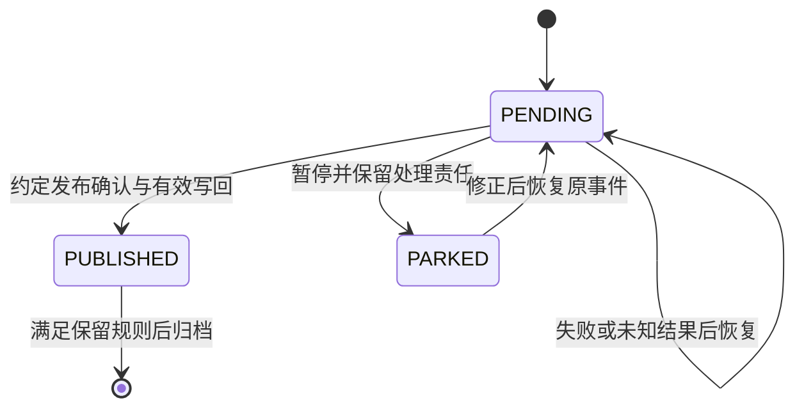

# 本地消息表与 RocketMQ 实现机制分析（Implementation Analysis）

本文在先保存的[《方案概述》](方案概述.md)基础上，深化表结构、状态流转、并发投递、消费幂等和故障恢复。主线仍是 Outbox 配合 RocketMQ 普通消息。本文给出机制约束、候选逻辑设计和验证要求，不给出依赖未知技术栈的可执行 DDL 或 SDK 实现。

分析日期：2026-10-05。引用的数据库和 SDK 版本用于说明行为差异，不表示本项目已经选择这些版本。

输入来源、实际阅读范围、当前采用范围及待补证据见[资料清单](资料清单.md)，确认失效与访问限制见[失效链接清单](失效链接清单.md)。永久核验记录保存在[references/source-audit.json](references/source-audit.json)。资料归档、静态文档审查与运行实现验证是不同的结果。

## 主要结论（Main Findings）

本地消息表的可靠性来自三个相互配合的条件：业务与待发意图原子提交，未完成阶段保留持久恢复来源，重复处理由业务数据库内的幂等机制仲裁。RocketMQ 的发送重试和消费重试是其中的传输恢复机制。

并发设计应将发布结果与处理资格分开。claim 表示本轮抢占，租约让退出的投递器可以被接替，claim_token 防止旧结果覆盖新状态。这些机制保护数据库中的任务记录，不能保证 Broker 只收到一份消息。

消费侧应把 Inbox 视为已完成本地处理的持久证据。记录与业务一起提交后，才能确认消费。发布确认、消费确认和业务完成回执应分别定义。

最终一致性需要恢复条件。永久业务错误、超出恢复窗口的数据删除、未约定的外部副作用，不能靠重复发送自动解决。

## 一致性约束（Consistency Invariants）

以下约束由现有方案和故障窗口推导，用于评估后续实现。

| 约束 | 含义 |
| --- | --- |
| 业务提交有发布意图 | 需要产生事件的业务提交，必须同时提交对应 Outbox。业务回滚时，Outbox 也回滚。 |
| 发布意图不提前丢弃 | 没有满足约定发布确认的记录，始终可恢复或处于有责任人处理的持久状态。 |
| 发布事实不可被旧结果回退 | 旧回调、旧租约持有者和旧失败结果，不能把已发布记录改回待发。 |
| 处理证据与业务一致 | 同一处理范围内，Inbox 成功记录与本地业务更新一起提交。 |
| 重投保持事件身份 | 同一个事件的重投复用同一 `event_id`，并保持相同的事件语义与载荷。 |
| 清理保留恢复义务 | 归档或清理前，明确仍可能发生的重投、回溯、人工补放和灾备恢复。 |

Transactional Outbox 原作者说明了业务与消息先同事务落库，以及发布成功但尚未记录时发生重复发布的窗口。这是上述约束的基础。租约、清理和业务回执的细化是本次设计推导。[Transactional Outbox](https://microservices.io/patterns/data/transactional-outbox.html)

生产入口的幂等与消费入口的幂等是两项职责。若同一个用户请求被执行两次，并各自生成不同事件 ID，消费去重不会把这两个事件识别为重复。需要另行确定生产入口的请求身份和业务唯一规则。

## 事件身份与消息契约（Event Identity and Message Contract）

`event_id` 标识一次已经产生的业务事件。它不应在每次发布重试时重新生成，也不应仅由消息体散列代替。两个不同事件可以具有相同载荷。

建议在业务提交时固化事件类型、契约版本、载荷和必要路由信息。重投应读取这份已提交的意图，不能重新查询最新业务状态后，以原事件 ID 拼装另一份消息。同一 ID 对应不同语义，应作为契约错误处理。

| 逻辑信息 | 用途 |
| --- | --- |
| `event_id` | 稳定事件身份。用于发布追踪和消费去重。 |
| `event_type`、`schema_version` | 指明业务含义和消息契约。 |
| `payload` | 固化本次事件的业务内容。 |
| `business_reference` | 定位业务对象或业务操作。 |
| `topic`、`tag` | 明确投递目标和过滤范围。实际值待确认。 |
| `correlation_id`、`causation_id` | 可选。分别关联业务链和直接来源事件。 |
| `payload_fingerprint` | 可选。检测载荷变化，不替代事件身份。 |

RocketMQ 的 `msgId` 用于定位某次 MQ 消息，`Keys` 用于检索。它们不自动建立业务数据库唯一约束。同一个业务消息可能出现不同 `msgId`，幂等需要稳定业务身份。[RocketMQ 最佳实践](https://rocketmq.apache.org/docs/bestPractice/01bestpractice/)

序列化、契约校验和消息大小检查应在业务提交前完成到足以确定事件可发布的程度。实际限制按选定 SDK 和服务版本核定。提交后才发现永久无法序列化或超过限制，会形成已提交但无法发布的事件。

## 候选逻辑表结构（Candidate Logical Data Model）

下列字段表达职责，不确定数据库类型、字段长度、具体表名和最终索引。

### 待发事件记录（Outbox Record）

| 逻辑字段 | 职责与条件 |
| --- | --- |
| `event_id` | 事件唯一身份。唯一范围需与事件命名空间一起确定。 |
| 事件类型、契约版本、载荷、路由 | 保存可重复投递的完整意图。 |
| `publish_state` | 记录发布阶段的持久状态。 |
| `next_attempt_at` | 记录下一次投递资格时间。 |
| `claim_token` | 每轮抢占更换的标识。用于数据库条件写回。 |
| `lease_until` | 记录当前抢占的恢复期限。 |
| `owner_id` | 定位投递实例。用于诊断，不替代抢占标识。 |
| 应用发布轮次 | 记录应用层尝试。计数时点必须定义。 |
| `last_attempt_outcome`、错误摘要 | 区分已确认、明确拒绝和结果未知。 |
| `created_at`、`published_at` | 用于跟踪等待和发布时间。不得直接假定它们表示全局提交顺序。 |
| 可选的人工处置信息 | 记录暂停原因、责任人、恢复决定和操作历史。 |

同一个事件若需要发布到多个 RocketMQ 目标，候选设计应为每个目标保存独立发布记录，或独立的投递子记录。任一目标成功不能代表全部目标成功。这是条件扩展，当前目标集合尚未确定。

### 已处理记录（Inbox Record）

| 逻辑字段 | 职责与条件 |
| --- | --- |
| `handler_id` 或 `subscriber_id` | 稳定的业务处理范围。同一处理器的多个实例共用此范围。 |
| `event_id` | 稳定事件身份。与处理范围组成唯一键。 |
| `producer_namespace`、`tenant_id` | 仅在事件身份需要命名空间或租户隔离时参与唯一范围。 |
| 处理完成时间 | 用于观测本地处理完成。具体时间采集语义待确认。 |
| `business_reference` | 指向已经完成的业务操作或对象。 |
| 事件类型、契约版本、载荷指纹 | 可选。用于校验和审计身份冲突。 |
| 结果引用、回执事件 ID | 可选。启用业务回执时用于恢复结果消息。 |
| MQ 消息 ID、ConsumerGroup | 可选观测字段，不自动成为业务唯一键。 |

候选唯一规则是“稳定逻辑处理器身份 + 稳定事件身份”，且身份字段不能为空。模式原作者使用 `(subscriberId, messageID)` 保存处理范围。[Idempotent Consumer](https://microservices.io/patterns/communication-style/idempotent-consumer.html)

最小 Inbox 中，一条已经提交的记录即可表示本地处理完成。若增加 `RECEIVED` 或 `PROCESSING` 等持久状态，必须同时定义确认边界、工作器恢复和停滞任务处理。不能把已受理记录当作已完成记录。

## 发布状态与处理资格（Publication State and Claim Eligibility）

建议采用两个维度。以下是候选设计，不是已确定的数据库枚举。

| 发布状态 | 含义与恢复责任 |
| --- | --- |
| `PENDING` | 尚未取得并记录约定的发布确认。可能已经发送过。保留恢复责任。 |
| `PUBLISHED` | 约定的发布确认已被持久记录。业务是否完成由消费侧决定。 |
| `PARKED` | 自动发送暂停，等待修正或人工决定。仍属于未完成发布，不能按成功清理。 |

自动处理资格首先要求 `publish_state = PENDING`。在此前提下，再由 `claim_token`、`lease_until` 和重试时间推导可抢占、持有中或已过期。`PARKED` 不参加自动扫描、抢占和发送；只有明确作出恢复决定、记录该决定并转回 `PENDING` 后，才能重新参与投递。无需用一个持久 `SENDING` 同时表示发送结果和占用状态。

发送超时通常应归为结果未知，不能统一解释为 Broker 未接收。一次 SDK 调用可能有多次内部尝试，最后一次明确拒绝，也不能否定此前某次未知尝试已被接收。[RocketMQ 发送重试](https://rocketmq.apache.org/docs/featureBehavior/05sendretrypolicy/)

暂停、释放、续租、重试时间更新和成功写回都需要明确并发条件。人工暂停或修改任务时，应使旧处理资格失效，防止旧结果改回新决定。

## 多实例投递与恢复（Concurrent Dispatch and Recovery）

### 抢占与发送顺序（Claim and Send Sequence）

1. 查询已提交、`publish_state = PENDING`、已到重试时间且可以抢占的记录。
2. 在短数据库事务中再次原子检查状态为 `PENDING`、重试已到期和旧处理资格可接替，再写入新的 `claim_token` 和租约。
3. 提交抢占事务。若提交结果未知，先从权威数据库核实状态，不能盲目开始发送。
4. 在事务之外调用 RocketMQ。
5. 依据本轮发送结果，用事件身份、当前抢占标识和预期发布状态作为数据库更新条件，写回结果。
6. 更新条件不成立时，不再覆盖记录；记录陈旧结果以供排查。

这里的 CAS 指条件比较更新。条件必须由数据库原子检查，不能拆成应用先查询、随后无条件更新。普通查询也不能自动保护后续写入。实际抢占语法应待数据库版本、隔离级别和复制方式确定。[MySQL 8.4 锁定读取](https://dev.mysql.com/doc/refman/8.4/en/innodb-locking-reads.html)、[PostgreSQL 事务隔离](https://www.postgresql.org/docs/current/transaction-iso.html)

不在数据库锁定事务内等待 Broker 网络响应。网络停顿会扩大锁持有时间和连接占用。抢占批量只覆盖当前可及时处理的容量，避免任务尚未开始发送就已租约过期。

### 旧处理者恢复后的竞态（Stale Worker Race）

假设 A 获得 `token_A` 后暂停。租约到期，B 获得 `token_B`。A 随后恢复并收到发送结果。A 的写回应因令牌不同而失败。

`claim_token` 保护 Outbox 元数据。它不是 Broker 内置检查的发送权限，也不会撤销已发出的网络请求。租约到期后，A 的旧请求与 B 的新请求都可能被接收。消费端仍须防止重复业务效果。[租约与 fencing 的原创机制分析](https://martin.kleppmann.com/2016/02/08/how-to-do-distributed-locking.html)

租约过期后的晚到成功确认有两种候选策略：

| 策略 | 条件与影响 |
| --- | --- |
| 严格租约策略 | 令牌仍匹配且租约有效，才记录成功。规则直接，但晚到确认可能引起再次发送。 |
| 当前令牌策略 | 令牌仍匹配且记录仍为 `PENDING`，允许记录已发请求的成功。新抢占已换令牌时仍拒绝旧结果。 |

需选择并统一实现其中一种。允许记录晚到确认，不表示允许过期处理者继续启动发送。发送前校验也不能消除检查后暂停的竞态，所以两种策略都接受重复发送。

### 稳定扫描与时间（Stable Scanning and Time）

持续缩小的待发集合不能使用不断增长的 `OFFSET`。例如第一批从 `[101,102,103,104]` 取走前两条，剩余集合变为 `[103,104]`；第二批再跳过两条，会遗漏本轮剩余任务。

候选方式是每批重新查询当前符合资格的记录，并使用唯一排序。使用 keyset 游标时，游标只用于单轮扫描，不能永久排除旧事件。较小 ID 的事务可能晚提交，旧事件也会因重试或租约到期重新取得资格。

PostgreSQL 的序列值可在提交前取得，回滚不会收回。因此，自增 ID 不能直接作为永久提交水位。分页需要可预测的排序。[PostgreSQL 序列](https://www.postgresql.org/docs/current/functions-sequence.html)、[PostgreSQL SELECT](https://www.postgresql.org/docs/current/sql-select.html)

`SKIP LOCKED` 可作为特定数据库中的队列访问候选，但不能由此推导公平性或业务顺序。数据库版本、隔离级别和复制模式均需核验。扫描还应周期性覆盖过期租约，避免只处理新增记录。

租约与到期比较采用明确的权威时间源。统一 UTC 不会消除实例时钟偏差。数据库时间函数也有语义差异，例如 PostgreSQL 的 `CURRENT_TIMESTAMP` 是事务开始时间。实际函数需按数据库核定。[PostgreSQL 时间函数](https://www.postgresql.org/docs/current/functions-datetime.html)

多区域实例如果分别通过异步复制副本更新同一事件，不能假定它们共享一个原子抢占点。跨区域所有权应在部署条件明确后分析。

扫描索引应围绕“到期待发记录”和“过期处理资格”两条路径评估。列顺序和是否拆分查询，依赖实际执行计划和数据分布。队首竞争、频繁续租、高重试事件及租户热点，也会影响吞吐和公平性。

## 消费幂等与确认（Idempotent Consumption and Acknowledgement）

### 原子处理顺序（Atomic Processing Sequence）

1. 校验稳定事件身份、事件类型和消息契约。
2. 开始本地事务，通过指定唯一规则登记 Inbox。
3. 首次处理时更新业务。继续向下游发消息或发送回执时，同时写入相应 Outbox。
4. 提交本地事务。失败时，业务、Inbox 和本次下游意图一起回滚。
5. 确认提交成功，或确认同一逻辑处理器此前已完成本事件后，才确认 MQ 消费。重复分支先清理失败事务；启用业务回执时，还需确保持久回执投递责任成立。无需等待回执的网络发送成功。

仅“先查询是否存在，再执行业务”有并发窗口。数据库唯一约束应成为重复竞争的仲裁点。记录的存在只有在它与业务同事务提交时，才能作为处理完成证据。[幂等消费者原作者说明](https://microservices.io/post/microservices/patterns/2020/10/16/idempotent-consumer.html)

| 遇到的情况 | 处理要求 |
| --- | --- |
| 本次登记及业务提交成功 | 确认消费。 |
| 指定 Inbox 唯一规则证明此前已完成 | 跳过重复业务，清理当前失败事务；启用回执时，先完成下面定义的回执恢复检查，再确认消费。 |
| 同键事务仍在执行 | 等待或重试，不因有人处理就提前确认。 |
| 死锁、锁等待超时、其他业务约束错误 | 按实际错误处理，不能统一当作重复成功。 |
| 同 ID 对应不同载荷 | 作为契约错误处理，不把错误复用解释为重复成功。 |
| 数据库提交结果未知 | 核实持久完成证据或保持可重试，不推断成功。 |

唯一冲突后的事务状态依赖数据库和框架。以官方文档为例，PostgreSQL 唯一检查可等待同键事务结束；错误事务需要正确回滚。MySQL 8.4 InnoDB 重复键错误通常只回滚当前语句。框架也可能把整个事务标记为 `rollback-only`。捕获异常不表示当前事务仍可提交。[PostgreSQL 唯一检查](https://www.postgresql.org/docs/18/index-unique-checks.html)、[MySQL 错误处理](https://dev.mysql.com/doc/refman/8.4/en/innodb-error-handling.html)、[Spring 事务传播](https://docs.spring.io/spring-framework/reference/data-access/transaction/declarative/tx-propagation.html)

### ConsumerGroup 与幂等范围（ConsumerGroup and Idempotency Scope）

同一处理器的多个实例共用稳定幂等范围。不要把实例 ID 放入唯一键。不同处理器若都需要处理同一事件，应有独立范围；只使用全局 `event_id` 会误拦截其中一个处理器。

在集群消费模式中，RocketMQ 同组实例分担同一种消费逻辑，不同组维护独立消费进度。4.x 广播消费则向组内各实例投递完整消息，不能套用同组分担的假设。同组订阅与过滤关系需要一致。库存、账务等不同业务处理器若都要获得完整事件，应采用独立消费组。[RocketMQ 领域模型](https://rocketmq.apache.org/docs/domainModel/01main/)、[4.x 消费模式](https://rocketmq.apache.org/docs/4.x/consumer/02push/)、[订阅关系一致性](https://rocketmq.apache.org/docs/bestPractice/08subscribe/)

业务幂等身份与 ConsumerGroup 的映射必须明确。组改名、迁移或增加实例不应自动改变业务身份。新处理器有意重建数据时，也应明确这是新的处理范围，还是同一范围内的重复恢复。

### API 家族与完成时点（API Families and Completion Point）

下面是已核验官方文档展示的 API 家族，用于说明差异。实际项目尚未选择这些接口。

| API 家族 | 成功与失败表达 |
| --- | --- |
| 4.x 经典 Java SDK 并发监听器 | `CONSUME_SUCCESS` 与 `RECONSUME_LATER`。 |
| 4.x 经典 Java SDK 顺序监听器 | `SUCCESS` 与 `SUSPEND_CURRENT_QUEUE_A_MOMENT`。 |
| 5.x 新 Java SDK PushConsumer | 监听器返回 `ConsumeResult.SUCCESS` 或 `FAILURE`。 |
| 5.x 新 Java SDK SimpleConsumer | 应用显式 `ack`；未确认时按不可见时间及重试机制恢复。 |

PushConsumer 的监听器不能把业务交给自建线程后提前返回成功。消费超时也不保证旧业务线程停止。SimpleConsumer 的不可见时间则不是数据库所有权锁。两者仍需要 Inbox 的并发仲裁。[Consumer Types](https://rocketmq.apache.org/docs/featureBehavior/06consumertype/)、[4.x PushConsumer](https://rocketmq.apache.org/docs/4.x/consumer/02push/)

Broker 5.x 不表示客户端必然采用新 SDK。官方 SDK 概述区分 Remoting 与 gRPC，应核对 Server、SDK 坐标、SDK 版本及协议，而非只看 Broker 大版本。[SDK Overview](https://rocketmq.apache.org/docs/sdk/01overview/)

若改为先持久受理、再由本地工作器执行业务，MQ 确认只能表示受理完成。这是另一种完成边界，当前基线没有选择。此时必须另行设计本地任务恢复，不能用受理记录代替已处理 Inbox。

## 发布确认与可靠性条件（Publish Confirmation and Reliability Conditions）

Outbox 的 `PUBLISHED` 必须对应明确的发送完成结果。同步发送检查结果，异步发送等待完成回调；`oneway` 没有 Broker 应答，不能作为本方案的发布确认依据。

4.x 文档中的 `FLUSH_DISK_TIMEOUT`、`FLUSH_SLAVE_TIMEOUT` 和 `SLAVE_NOT_AVAILABLE` 可能出现在 Broker 已接收、但约定刷盘或复制条件未完成时。这些结果应按可能重复且尚未满足确认门槛处理。`SEND_OK` 的持久性仍受部署配置与故障模型限制。[4.x 发送结果与可靠性](https://rocketmq.apache.org/zh/docs/4.x/bestPractice/01bestpractice/)

需要先明确要承受的故障，再确定确认门槛。进程退出、主机失效、断电、磁盘损坏和机房失效不是同一故障模型。同步刷盘与同步复制也承担不同职责。

若选择 Controller 部署，官方还提供同步副本集合、最小同步副本和非同步副本选主等配置。不能只检查单个开关便声称数据在所有故障下可恢复。具体配置与故障实验留待实际部署确定。[Controller 自动切换文档](https://rocketmq.apache.org/zh/docs/deploymentOperations/03autofailover/)

## 重试与失败处置（Retries and Failure Handling）

| 层次 | 恢复范围 |
| --- | --- |
| SDK 发送重试 | 一次调用内的短暂发送故障。无法代替进程退出后的恢复。 |
| Outbox 发布重试 | 已提交意图的持续发布恢复。保持原事件身份。 |
| RocketMQ 消费重试 | 下游业务处理失败或未确认后的重新投递。 |

三层分别核定次数、超时和耗时口径。应用发布轮次不能直接解释为真实网络请求数，因为 SDK 可能内部重试。需要退避、抖动和并发上限，避免故障时放大发送压力；具体数值取决于实际延迟、容量和恢复目标。

达到自动重试上限不等于完成。Outbox 发布失败应保留可查询的意图，例如进入 `PARKED`。消费死信需要独立告警、修复和补放流程。责任人、处置结果和关联事件必须可追踪。

4.x 文档中，集群消费支持失败重试，广播消费没有相同的自动重试机制。5.x 文档则按 PushConsumer 和 SimpleConsumer 分别定义重试。不能跨模式套用默认值。[消费重试](https://rocketmq.apache.org/docs/featureBehavior/10consumerretrypolicy/)、[4.x PushConsumer](https://rocketmq.apache.org/docs/4.x/consumer/02push/)

补放原事件应复用原 `event_id`。若修正内容改变了业务语义，需要明确定义新的修正操作及与原事件的关系，不应偷偷替换旧事件载荷。永久业务错误也需要业务失败规则；只有重试机制而没有处置规则时，不能宣称最终一致性已经闭环。

## 业务回执与多级消息链（Business Receipts and Message Chains）

业务回执是可选应用协议。启用时，下游在本地业务事务中同时提交处理结果、Inbox 和回执 Outbox。事务提交后，回执由投递器发送到 RocketMQ。上游处理回执也需要原子幂等。

原事件重复到达时，不重复执行业务，但要确保先前成功回执仍可发布或再次返回。回执的结果来自持久完成证据。否则回执丢失会使上游长期无法结束跟踪。

重复分支先回滚或清理唯一冲突造成的失败事务，再读取持久完成证据并检查回执恢复责任。原回执仍有可恢复的投递记录时，可沿用该记录。原回执已经 `PUBLISHED` 或归档且协议要求补投时，幂等登记单独的补投任务，复用原回执的事件身份、结果和载荷；不得把原发布事实回退为待发。补投意图持久成立后，才确认原消息。这个顺序不要求等待回执发送成功。

补投任务需有独立任务身份，例如候选字段 `task_id`；回执消息继续复用原 `event_id`。补投任务的并发去重与回执消费的业务幂等分别定义，不能向以 `event_id` 唯一的原表直接插入冲突记录，也不能永久禁止后续合法补投。具体任务模型、触发条件和补投轮次尚待确定。

归档必须保留恢复回执所需的信息；若完成证据或结果已被清理，不能仅凭 Inbox 命中就声称回执已恢复，也不能重新执行业务来补造结果。以上是启用回执时的候选恢复机制。[Outbox 的持久投递责任](https://microservices.io/patterns/data/transactional-outbox.html)、[重复消费的事务清理顺序](https://microservices.io/post/microservices/patterns/2020/10/16/idempotent-consumer.html)

回执至少关联原事件、逻辑处理器、完成含义和结果。多个处理器都必须完成时，上游应保存所需处理器集合及各自结果，不能把任意一个回执当作全部完成。这是本次组合设计推导，尚未选择是否启用。

对于 A→B→C，B 的 Inbox、业务更新与发往 C 的 Outbox 同事务提交。B 的本地完成不自动表示 C 完成。B 产生的新事件使用自己的事件 ID，以 `causation_id` 关联输入事件；该新事件的重投继续复用自己的 ID。

Inbox 只覆盖同一本地事务中的资源。HTTP 扣款、邮件或其他网络副作用不会随数据库回滚。若本地事务包含这类调用，应确认对方是否支持稳定操作身份、幂等执行或结果查询。否则不能承诺外部动作仅执行一次。

## 顺序与消费组初始化（Ordering and Consumer Group Initialization）

普通消息基线没有承诺严格业务顺序。两个不同事件即使都不会重复产生结果，也可能以错误顺序修改同一业务对象。幂等与顺序需要分别设计。

若业务要求严格顺序，需在同一本地消息表方案内进一步选择 RocketMQ 的顺序特性，并约束按业务键串行发布和消费。5.x 顺序消息文档要求相应消息组的单生产者串行发送；它不会自动恢复数据库提交顺序。

同一业务对象的事件应有明确的业务版本或序号。多投递器不能无序发布后，再期待 Broker 还原原始因果顺序。消费侧还需定义旧事件、序号缺口、前序失败和补放的处理规则。顺序消息达到重试上限后，后续消息仍可能继续处理。[RocketMQ Ordered Message](https://rocketmq.apache.org/docs/featureBehavior/03fifomessage/)

该顺序扩展需要确认版本、Topic 类型、排序键和失败规则后再决定。它尚未修改当前普通消息基线。

5.x 消费进度文档说明，新消费组首次获取消息默认从当前最大位点开始。新增组不能自动获得全部历史事件。上线新处理器时，需安排初始化位点、补数来源及新组幂等范围。[消费进度管理](https://rocketmq.apache.org/docs/featureBehavior/09consumerprogress/)

## 保留与灾备恢复（Retention and Disaster Recovery）

RocketMQ 的消息保留与是否已消费无关。存储期到期后消息会被清理，磁盘压力也可能缩短实际恢复窗口。回退消费位点只能重放仍存在的数据。[消息存储与清理](https://rocketmq.apache.org/docs/featureBehavior/11messagestorepolicy/)

Outbox、Broker、Inbox 和人工补放的保留规则应共同定义：

1. 发布意图尚未确认或仍待人工处置时，不能按成功记录清理。
2. 已发布 Outbox 的归档需要保留约定的恢复来源。Broker 接收不等于所有消费组业务完成。
3. Inbox 需要覆盖同一事件最晚可能再次到达的时间。包括迟到补发、消费重试、死信补放、历史回溯和灾备恢复。
4. 串行发生的等待可能累加。不能只取几个独立超时中的最大值，也不能简单照搬 Broker 保留期。
5. 若允许无限期补放旧事件，需要永久业务去重依据，或明确限制补放窗口。有限 Inbox TTL 无法覆盖无限重放。
6. 业务数据、Inbox 和 Outbox 的备份恢复必须维持一致恢复点。只恢复其中一项，会重新引入重复或丢失意图。

清理 Inbox 后，旧事件可能被当作新事件。反过来，有意重建数据时，旧 Inbox 也可能拦截预期重建。需要区分重复恢复与新的业务修正或重建，不能靠批量删除去重记录模糊处理。

## 监控与容量（Monitoring and Capacity）

监控应连接事件意图、MQ 投递和业务结果。以下为指标方向，具体名称和阈值待实际版本与容量确定。

| 层次 | 重点观察 |
| --- | --- |
| Outbox | 待发量、最老待发年龄、过期租约、抢占冲突、陈旧写回拒绝、未知发布结果、待人工事件年龄。 |
| Broker | 各组积压与等待时间、死信、磁盘空间、刷盘延迟、复制落后与拒绝写入。 |
| 消费端 | 业务处理耗时、事务失败、重复命中、事件身份冲突、按处理器统计的完成结果。 |
| 可选回执 | 已发布但未获得业务结果的事件、逐处理器完成延迟、回执恢复积压。 |

SDK 重试、应用发布轮次、消费重试的统计分别记录，避免计数含义混乱。日志以事件身份和因果关联贯穿各阶段，MQ 消息 ID 用于定位具体投递。

官方 Metrics 文档注明其新指标自 5.1.0 开始支持。文档导航标记为 5.0，并不意味着每个指标从 5.0 起存在。指标名和实际可用性应按版本核对。[RocketMQ Metrics](https://rocketmq.apache.org/zh/docs/observability/01metrics/)

容量评估应包含最大中断期间累积的事件、恢复期间新增流量、平均与最大载荷、消费追赶能力，以及索引和历史记录。仅增加投递器实例可能把瓶颈转移到数据库队首、热点业务行或 Broker。

## 故障验证矩阵（Failure Verification Matrix）

下面是实现后的验证要求。当前没有执行这些实验。

| 故障或竞争 | 应观察的恢复结果 |
| --- | --- |
| 业务事务回滚 | 业务与 Outbox 均不留下本次提交结果。 |
| 业务与 Outbox 提交后立即终止进程 | 扫描恢复后仍发现待发事件。 |
| 较小 ID 的事务晚提交，扫描集合同时缩小 | 旧事件仍被后续轮次发现，不被永久游标排除。 |
| 两个投递器同时抢占同一事件 | 数据库原子仲裁处理资格；竞争失败者不无条件发送。 |
| 任务暂停为 `PARKED`，旧回调晚到或自动扫描继续运行 | 旧结果不撤销暂停决定；任务不被自动抢占，明确恢复后才重新投递。 |
| claim 已提交，发送前退出 | 租约到期后取得新的 claim 并恢复。 |
| Broker 接收后丢弃应答 | 允许重复发布，重投保持稳定身份。 |
| 发布成功后，本地状态更新失败 | 后续重投不重复产生业务效果。 |
| A 过期、B 已抢占，A 的成功或失败晚到 | A 的条件写回被拒绝，既有发布事实不会回退。 |
| 消费事务失败 | Inbox、业务及本次下游 Outbox 一起回滚。 |
| 消费事务提交后丢失确认 | 重投识别已完成记录，业务不再次执行。 |
| 消费超时后旧线程继续执行 | 新旧执行重叠时仍由数据库幂等仲裁。 |
| 唯一冲突、死锁、其他业务约束错误 | 仅指定重复身份可按已完成处理，其他错误不会被误确认。 |
| 回执丢失或多处理器只有部分完成 | 回执可恢复，未完成处理器可识别。 |
| 原事件重复到达，回执已发布或归档 | 不重做业务；按协议持久登记必要的回执补投，再确认原消息。 |
| Broker 确认后发生选定故障模型中的故障 | 恢复结果符合已选择的持久化和复制目标。 |
| 自动重试耗尽 | 持久保留事件与处置责任，不伪报业务完成。 |
| 数据清理或从备份恢复后再次补放 | 仍遵守约定的恢复窗口与幂等规则，能识别数据缺口。 |

关键验收证据应由业务数据库、Outbox、Inbox 和 MQ 记录共同提供。单独的发送成功日志或 MQ 消费成功计数，不足以证明业务事务提交。

## 落地前的待确认信息（Implementation Prerequisites）

| 信息 | 决定的设计细节 |
| --- | --- |
| Server 版本、自建或云服务、部署模式 | 发布确认的可靠性门槛、复制、故障域和保留规则。 |
| SDK 坐标、版本、协议和消费类型 | 发送结果、回调、确认、重试及不可见时间接口。 |
| 数据库、版本、隔离级别和事务框架 | 原子抢占、唯一冲突、索引、锁与回滚处理。 |
| 业务处理范围及外部副作用 | 哪些效果可以与 Inbox 原子提交，哪些需要独立幂等协议。 |
| Topic、过滤、目标处理器及业务回执要求 | 发布目标、幂等范围和完成集合。 |
| 是否要求按业务对象排序 | 普通消息是否满足要求，是否需要顺序扩展。 |
| 峰值流量、最长中断和恢复目标 | 批大小、租约、并发、退避、保留和监控阈值。 |

当前已完成机制分析和候选设计。上述条件补齐后，才能进一步确定数据库结构、SDK 调用和部署参数。本文没有实现业务代码，没有运行数据库或 RocketMQ 故障实验。
