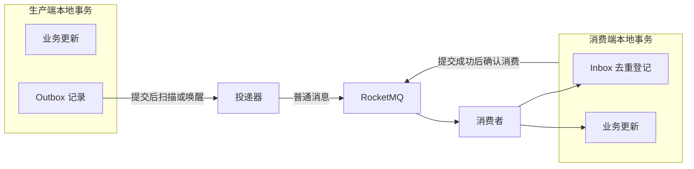

# 本地消息表与 RocketMQ 方案概述（Solution Overview）

本文整理前文方案基线。用户已明确将消息中间件限定为 RocketMQ。前文方案建议采用普通消息投递，由本地消息表保存待执行的发布意图。本文记录机制要求和设计建议，具体工程实现尚未验证。

核心机制是：生产端在一个本地事务中提交业务更新和待发消息；投递器持续恢复待发记录；消费端在一个本地事务中完成去重登记和业务更新。允许消息重复，通过业务幂等避免重复产生业务结果。

整理日期：2026-10-05。RocketMQ 版本、SDK、数据库和消费类型尚未确定。本文不指定这些技术参数。

## 目标与范围（Goals and Scope）

服务拆分后，数据库更新与 RocketMQ 网络发送属于两个独立操作。进程退出、网络超时或响应丢失，可以使一个操作成功而另一个操作失败。数据库本地事务不能将普通 MQ 发送纳入同一次原子提交。

本方案先在业务数据库中持久化后续发布意图，再将网络发送交给可恢复的投递器。在数据库记录保持可恢复、RocketMQ 满足约定的可靠性条件、消费业务可以完成且失败有人处理的前提下，推进最终一致性。

范围包括 Outbox、本地事务、RocketMQ 发布确认、Inbox、消费确认、两端重试、死信处理、并发投递和运行监控。本文仅保留本地消息表与 RocketMQ 的实现内容。

## 术语与职责（Terms and Responsibilities）

| 名称 | 含义与职责 |
| --- | --- |
| Outbox | 生产端本地消息表。保存已经随业务提交的待发事件，以及发布状态和恢复信息。 |
| 投递器 | 从 Outbox 获取待发事件，发送到 RocketMQ，并根据发送结果更新记录。 |
| Broker | RocketMQ 的消息服务端。接收、存储并向消费者投递消息。 |
| Inbox | 消费端持久化去重记录。与消费业务更新一起提交。 |
| `event_id` | 应用生成的稳定事件标识。同一个事件重投时保持不变。 |
| 发布确认 | 生产端依据所用 RocketMQ SDK 的成功判定条件，确认本次发布成功。 |
| 消费确认 | 消费端在本地业务事务提交成功后，向 RocketMQ 确认本次处理成功。 |
| 业务回执 | 可选应用消息。由下游向上游报告业务处理结果。它与 MQ 的消费确认属于不同层次。 |

RocketMQ 重发可能使同一个业务事件具有不同的 `msgId`。本方案使用 `event_id` 和数据库唯一约束完成业务去重。`Keys` 可用于检索和排查，不承担数据库唯一约束的职责。[RocketMQ 幂等消费与 Keys 说明](https://rocketmq.apache.org/docs/bestPractice/01bestpractice/)

## 架构与事务边界（Architecture and Transaction Boundaries）

图中每个本地事务分别使用自己的数据库事务。消息发送和 MQ 确认位于本地事务之外。图中连线表示处理关系，不表示跨服务存在一个数据库事务。

| 边界 | 必须一起提交的操作 |
| --- | --- |
| 生产端 | 业务更新与 Outbox 插入。使用同一数据库本地事务。 |
| 消费端 | Inbox 去重登记与业务更新。使用同一数据库本地事务。 |
| 消息链中间节点 | 若 B 消费 A 的消息后还要向 C 发消息，则 B 的 Inbox、业务更新与下游 Outbox 同事务提交。 |
| 投递器 | 获取待发任务、网络发送、写回发送结果是不同阶段。任务抢占与恢复机制必须容纳进程退出和重复发送。 |

多级消息链的事务边界参考[本地消息表与 RocketMQ 实战](https://www.cnblogs.com/awaking/p/14631057.html)。该文章正文已读，关联仓库未运行验证。

## 正常处理流程（Normal Processing Flow）

1. 生产端为本次业务事件生成稳定的 `event_id`。
2. 生产端开启本地事务，更新业务记录，并插入 Outbox 记录。
3. 生产端提交本地事务。事务回滚时，业务更新与 Outbox 记录一起回滚。
4. 投递器扫描已提交的待发记录。提交后的通知可加快发现速度，数据库记录承担恢复职责。
5. 投递器取得记录的处理资格，将事件发送为 RocketMQ 普通消息。
6. 发送成功后，投递器记录发布完成；失败或结果未知时，保留可恢复状态。重投继续使用原 `event_id`。
7. 消费者收到消息后，开启自己的本地事务，通过数据库唯一约束登记 Inbox。
8. 对首次处理的事件执行业务更新。Inbox 与业务一起提交。对已确认处理成功的重复事件，跳过重复业务更新。
9. 消费事务提交成功后，消费者确认消费。消费事务失败时，返回失败结果或保持未确认，由实际消费类型的重试机制处理。

消费去重必须处理并发竞争。仅执行“先查询、再更新”，无法独立防止两个消费者同时处理同一事件。唯一冲突的异常处理方式，需要结合实际数据库和事务框架确定。

## 确认与完成含义（Acknowledgement and Completion）

`PUBLISHED` 是本方案使用的概念状态，表示事件的发布已经按约定确认。它不是 RocketMQ 的通用 API 状态名，也不表示下游业务已经完成。具体数据库状态集合留待深化分析。

RocketMQ 客户端发送重试有次数限制。最终异常仍需要应用处理。超时也可能发生在 Broker 已接收消息之后，因此恢复发送会产生重复。[RocketMQ 发送重试说明](https://rocketmq.apache.org/docs/featureBehavior/05sendretrypolicy/)

上游是否必须获得下游业务完成结果，尚未确定。基础流程以发布确认结束 Outbox 发布任务。若业务要求跟踪下游处理结果，则在同一方案内增加通过 RocketMQ 传递的业务回执。回执必须有持久恢复和幂等处理机制。消费者已经处理成功但回执丢失时，重复请求不能再次执行业务，但仍须使成功回执可以恢复投递。

## 失败恢复原则（Failure Recovery Principles）

| 故障位置 | 恢复原则 |
| --- | --- |
| 生产端本地事务提交前退出 | 由数据库回滚未提交业务与 Outbox。 |
| 生产端提交后、投递器发送前退出 | Outbox 保留待发意图，恢复扫描后继续投递。 |
| 网络发送失败或超时 | 保留记录并重试；结果未知时接受可能重复。 |
| Broker 接收成功、Outbox 更新前退出 | 记录可能被再次投递，由稳定 `event_id` 和消费幂等处理。 |
| 消费事务提交前退出 | 本地事务回滚；后续投递可以重新处理。 |
| 消费事务提交后、消费确认前退出 | RocketMQ 可能再次投递；Inbox 防止再次修改业务。 |
| 消费重试耗尽 | 进入实际版本和消费类型支持的死信处理流程，告警并进行修正、重放或人工处置。 |

发布重试由 Outbox 恢复机制负责。消费重试由 RocketMQ 的相应消费机制负责。两者不能混用同一个重试次数，也不能用“发布成功”判断“消费成功”。RocketMQ 的重试策略和配置位置随消费类型变化。[RocketMQ 消费重试说明](https://rocketmq.apache.org/docs/featureBehavior/10consumerretrypolicy/)

死信表示自动消费重试已停止。它不表示业务完成。失败事件必须可查询、可追踪、可处置，处置结果必须记录。

## 范围约束与待确认信息（Scope Constraints and Open Questions）

| 项目 | 当前状态 |
| --- | --- |
| MQ | 已确定为 RocketMQ。 |
| 发布机制 | 前文方案建议采用本地消息表配合普通消息，作为本次深化分析的基线。 |
| 生产端原子性 | 本方案的机制要求：业务与 Outbox 同事务提交。 |
| 消费端原子性 | 本方案的机制要求：Inbox 与业务更新同事务提交。 |
| 事件标识 | 本方案的机制要求：重投复用稳定 `event_id`，由唯一约束支持幂等。 |
| RocketMQ 版本与 SDK | 待确认。不能混用不同客户端的接口与返回状态。 |
| 消费类型与消费模式 | 待确认。重试、确认和并发配置按实际类型核定。 |
| 数据库、版本与事务框架 | 待确认。影响抢占方式、索引、唯一冲突与回滚处理。 |
| 下游业务范围 | 待确认。尤其需要明确事务内是否包含外部网络操作。 |
| 业务完成回执 | 待确认是否需要，以及哪些消费方需要回执。 |
| 顺序要求 | 待确认是否按业务对象保持顺序。 |
| 流量、可用性与保留时间 | 待确认。决定容量、并发、重试预算、历史保留和清理规则。 |

这些未知信息不阻止机制层分析。但在确定实际 DDL、SDK 调用和部署参数之前，必须补齐影响实现的条件。

## 后续分析顺序（Next Analysis Sequence）

现有方案基线先保存，再开展深化分析。后续按以下顺序检查机制：

1. Outbox、Inbox 的逻辑字段、唯一约束与索引要求。
2. 发布状态、业务处理状态与处理资格的区分。
3. 多实例抢占、租约、过期任务恢复和陈旧结果写回。
4. 消费幂等、事务提交与消费确认的先后关系。
5. 各故障窗口下的恢复路径，以及重试、死信与人工处置。
6. 顺序、回执、多级消息链、数据保留和运行监控的适用条件。

后续结论应区分通用机制、候选设计和待确认的版本差异。不得将概念设计写成已实现或已验证。

深化结果见[《实现机制分析》](实现机制分析.md)。

## 来源与阅读边界（Sources and Reading Scope）

完整输入来源、去重关系、访问状态、阅读范围和当前方案采用范围见[资料清单](资料清单.md)。确认失效、访问受限及待核验项见[失效链接清单](失效链接清单.md)，最小永久证据见[来源核验记录](references/source-audit.json)。下面列出本方案使用的引用，不表示用户提供的全部资料均已完整阅读。缺少逐项核验记录的来源，在清单中明确标为待补。

| 来源 | 本文使用范围 |
| --- | --- |
| [RocketMQ Basic Best Practices](https://rocketmq.apache.org/docs/bestPractice/01bestpractice/) | 业务幂等、重复消息与 Keys。官方网页文字已读。 |
| [RocketMQ Sending Retry and Throttling Policy](https://rocketmq.apache.org/docs/featureBehavior/05sendretrypolicy/) | 发送失败、超时、有限重试与重复发送。官方网页文字已读。 |
| [RocketMQ Consumption Retry](https://rocketmq.apache.org/docs/featureBehavior/10consumerretrypolicy/) | 消费重试、死信与消费类型差异。官方网页文字已读。 |
| [本地消息表与 RocketMQ 实战](https://www.cnblogs.com/awaking/p/14631057.html) | 多级消息链与本地事务边界。文章正文及内联代码已读，相关仓库未运行验证。 |
| [四种基于 MQ 的分布式事务解决方案](https://juejin.cn/post/7172881406182293511) | 仅借鉴本地消息表、扫描和快速唤醒机制；不将历史配置作为现行配置。 |

用户导出书签中已经确认失效、访问受限或原文未取得的资料，不作为本文的完整技术证据。访问状态与方案范围分别登记，范围排除不表示链接失效。本文没有运行示例代码，也没有将文章中的成功演示作为本项目的实现验证。
